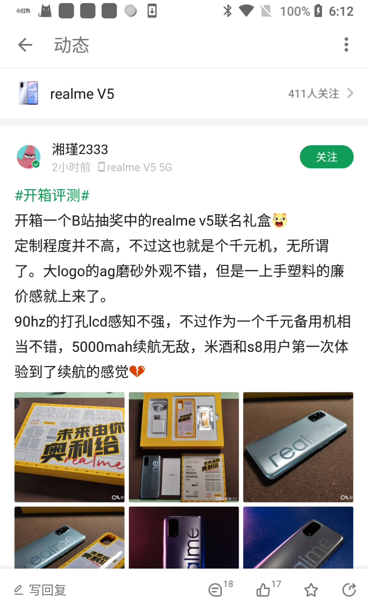
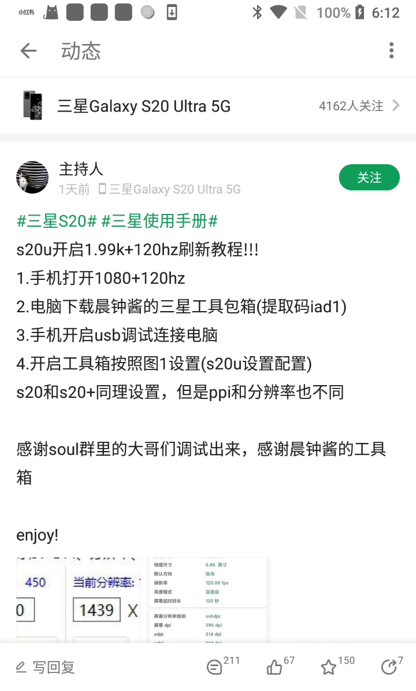
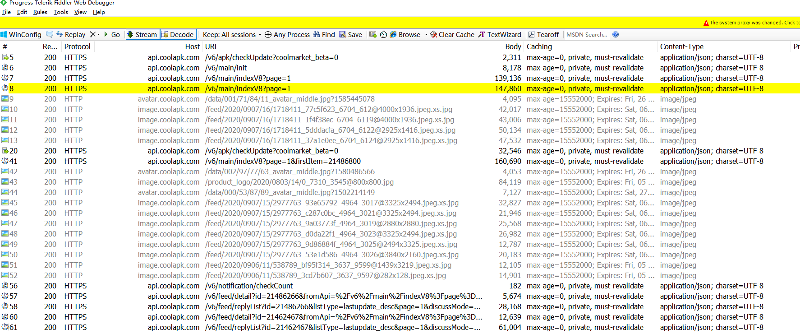
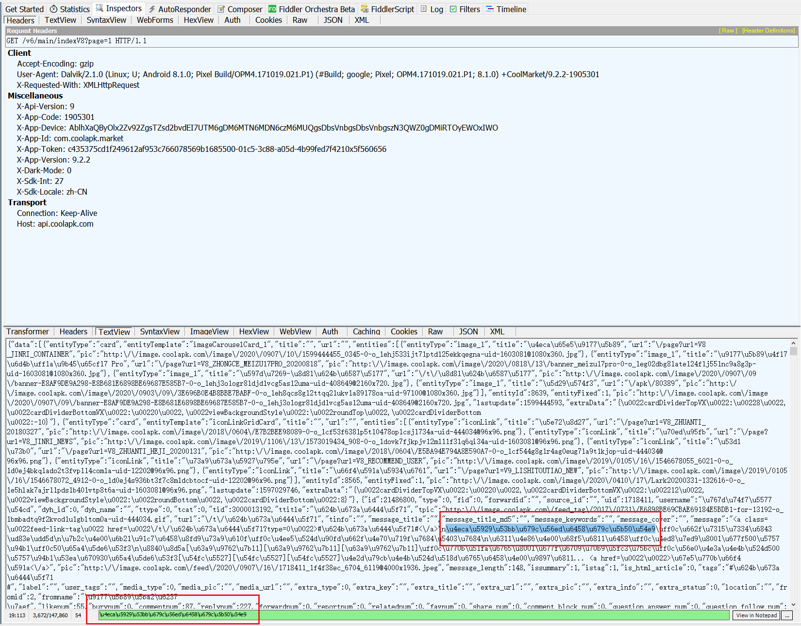
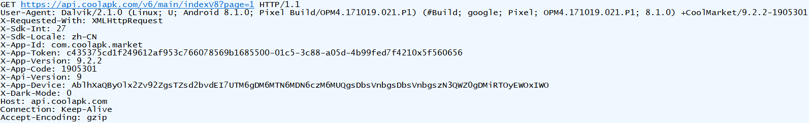
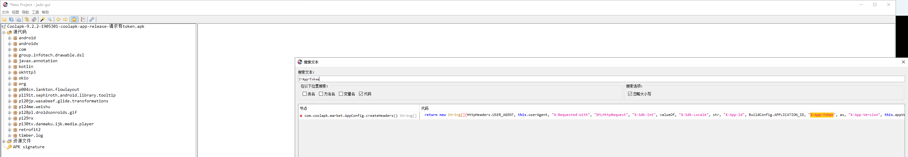
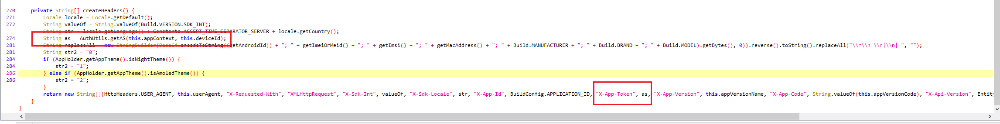
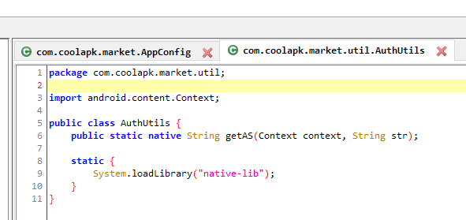
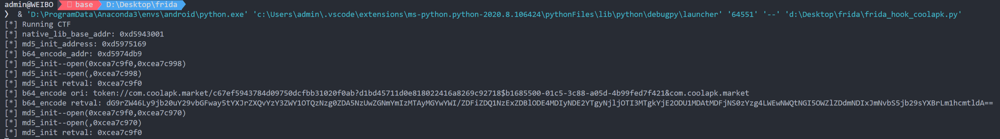

# 某安APP逆向爬虫

 爬取某安APP的相关信息，仅做学习用。 

# 1. 准备工作

* apk

  |      Name       |               Property                |
  | :-------------: | :-----------------------------------: |
  | ApplicationName |                 酷安                  |
  |   PackageName   |          com.coolapk.market           |
  |     Version     |                 9.2.2                 |
  | InternalVersion |                1905301                |
  |     Min SDK     | API Level 21 (Android 5.0 - Lollipop) |
  |     Max SDK     |    API Level 28 (Android 9 - Pie)     |
  |   PackageSize   |                25.03MB                |
  |       MD5       |   350F40FC0F3C47AFB5096A77E7E06AE2    |

* 工具

  |     工具     |             版本             |
  | :----------: | :--------------------------: |
  |    frida     |           12.11.12           |
  | frida-tools  |            8.1.3             |
  | frida-server |    12.11.12-android-arm64    |
  |     jadx     |            1.1.0             |
  |     ida      |             7.0              |
  |   fiddler    |       v5.0.20202.18177       |
  |    phone     | Pixel-sailfish Android 8.1.0 |
  |              |            2.4.1             |

# 2. 开始

### 2.1 抓包

首先抓包，手机连接电脑，配置好fiddler和网络后，打开app


刷新后


点开其中一条动态



退出，点开另一条动态



查看fiddler抓包情况，



搜索关键内容，并定位到上述标黄请求，

```
今天去果园摘果子哩

\u4eca\u5929\u53bb\u679c\u56ed\u6458\u679c\u5b50\u54e9
```

查看请求详情，可知抓包无异常



分析请求参数，




多次请求后发现，其余参数均为改变，只有<font size="5" color="orange">X-App-Token</font>在改变。


### 2.2 jadx寻找关键参数生成逻辑

jadx打开apk文件，搜索X-App-Token



仅有一处，追溯进去




猜想此处即为请求所需参数拼接处。

跳到方法getAS的定义处，



可知getAS方法加载自libnative-lib.so库

用apktool解包后，用ida打开libnative-lib.so文件

Functions Window搜索getAS，没有结果，搜索getA，找到getAuthString函数，猜想getAS映射自getAuthString

进入getAuthString，转为C代码，移至文件末尾，函数return的结果即为token值，分析代码，有

```c
token = v55 = v82
v82 = v61 + device_id + "0x" + timestamp_hex // 时间戳的十六进制形式
v61 = md5(v58).hexdigest()
v58 = v52 = v51
v51 = b64_encode(v49)
v49 = v62
v62 = v65 + v45 + "$" + device_id + "&" + package_name
```

此时可用frida hook MD5或b64_encode函数进行验证

frida_hook_lib_native.js

```javascript
var getAuthString_absulate_addr = Module.getExportByName("libnative-lib.so", "getAuthString");
var native_lib_base_addr = parseInt(getAuthString_absulate_addr) - parseInt('0x66500');
send('native_lib_base_addr: ' + ptr(native_lib_base_addr));

// 用libnative-lib.so基地址加上MD5:MD5()的偏移量 就是MD5:MD5()在内存中的地址
// md5_init_address 是int型
var md5_init_address = ptr(native_lib_base_addr + parseInt('0x32168'));
send('md5_init_address: ' + md5_init_address);

// hook MD5::MD5()
try{
    Interceptor.attach(md5_init_address,
    {
        onEnter: function (args) {
            send("md5_init--open(" + args[0] + "," + args[1] + ")");
            send("md5_init--open(" + Memory.readUtf8String(args[0]) + "," + args[1] + ")");
        },
        onLeave: function (retval) {
            send("md5_init retval: " + retval);
        }
    });
}
catch (error) {
    console.log(error);
}

// hook b64_encode()
var b64_encode_addr = ptr(native_lib_base_addr + parseInt('0x31DB8'));
send("b64_encode_addr: " + b64_encode_addr);
Interceptor.attach(b64_encode_addr,
    {
        onEnter: function (args) {
            send("b64_encode ori: " + Memory.readUtf8String(args[0]));
        },
        onLeave: function (retval) {
            send("b64_encode retval: " + Memory.readUtf8String(retval));
        }
    }
);
```

frida_hook_lib_native.py

```python
import sys
import frida

def on_message(message, data):
    if message['type'] == 'send':
        print(f"[*] {message['payload']}")
    else:
        print(message)

jscode = open("frida_hook_lib_native.js", "r", encoding='utf-8').read()
process = frida.get_usb_device().attach('com.coolapk.market')
script = process.create_script(jscode)
script.on('message', on_message)
print('[*] Running CTF')
script.load()
sys.stdin.read()
```

运行程序，有结果



其中b64_encode()函数的参数为

```
token://com.coolapk.market/c67ef5943784d09750dcfbb31020f0ab?d1bd45711d0e818022416a8269c92718$b1685500-01c5-3c88-a05d-4b99fed7f421&com.coolapk.market
```

与之前所分析的v62参数很像，多次尝试后发现参数中仅有v45参数发生变化

跟进v45参数生成逻辑

```c
v45 = v68
v68 = md5(v65).hexdigest()
v65 = s  // 此时的v65与之前v62等式中的v65不同
s = timestamp_int  // 时间戳的十进制形式
```

此时可知，

```c
v62 = v65 + md5(timestamp_int).hexdigest() + "$" + device_id + "&" + package_name
v65 = "token://com.coolapk.market/c67ef5943784d09750dcfbb31020f0ab?"
```

可知此时，token的生成逻辑

```c
token = md5(b64_encode(v62)).hexdigest() + device_id + "0x" + timestamp_hex
v62 = v65 + md5(timestamp_int).hexdigest() + "$" + device_id + "&" + package_name
v65 = "token://com.coolapk.market/c67ef5943784d09750dcfbb31020f0ab?"
package_name = "com.coolapk.market"
```

python生成token
getToken.py

```python
import time
import hashlib
from base64 import b64encode


def get_token(device_id):
    timestamp = int(time.time())
    v62 = f"token://com.coolapk.market/c67ef5943784d09750dcfbb31020f0ab?{hashlib.md5(str(timestamp).encode()).hexdigest()}${device_id}&com.coolapk.market"
    token = f"{hashlib.md5(b64encode(v62.encode())).hexdigest()}{device_id}0x{hex(timestamp)}"
    return token


device_id = "b1685500-01c5-3c88-a05d-4b99fed7f421"
token = get_token(device_id)
print(token)
```

### 2.3 尝试抓取

